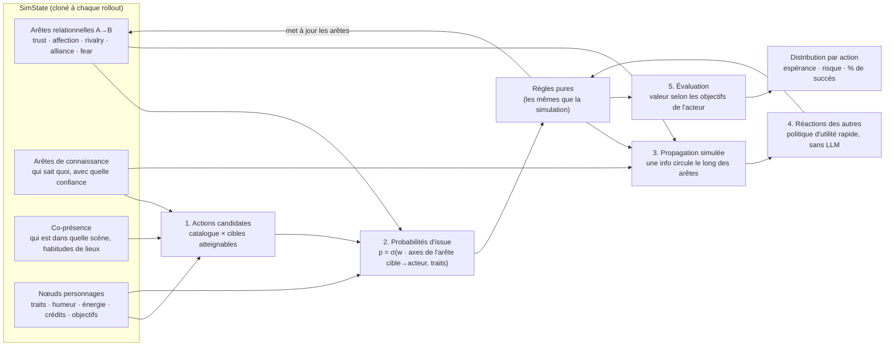
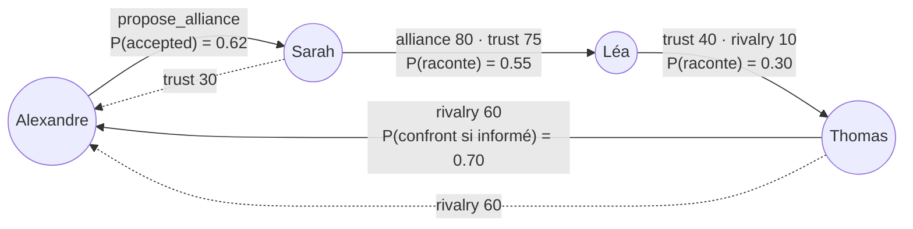
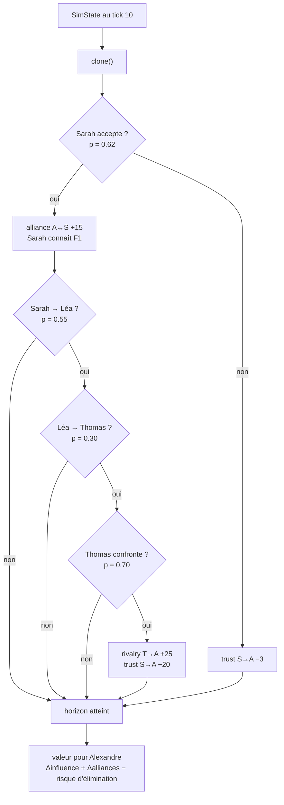

# AI Reality World — Catalogue d'actions et points d'ancrage du modèle de décision

Document de conception · V0.1 · 2026-10-03

> Le modèle de décision complet (fonctions d'utilité, issues probabilistes, Monte Carlo) sera décrit dans
> `decision-model.md` **en fin d'implémentation**. Ce document fixe dès maintenant ce qui structure le schéma et les
> interfaces, pour pouvoir brancher ce modèle plus tard sans rien refaire.

---

## 1. Ce qui doit exister dès la V1

| Élément | Pourquoi maintenant |
|---|---|
| **Catalogue fermé d'actions** (§2) | Agenda, interactions, règles et effects s'y réfèrent. Un texte libre empêcherait tout calcul de probabilité. |
| **Vocabulaire fermé d'issues par action** (§3) | Les règles de résolution sont indexées sur `(action, issue)`. |
| **Ordre du pipeline : action → issue → dialogue → vérification** (§4) | Si l'issue est décidée avant le dialogue dès la V1, le modèle probabiliste remplacera le LLM sans changer le flux. |
| **Deux points d'injection : `DecisionPolicy` et `OutcomeModel`** (§5) | Implémentation LLM en V1, utilité et Monte Carlo ensuite. |
| **Traçabilité des décisions** (table `decision`, §6) | Rejeu, explicabilité, affichage des options au joueur en mode directif. |
| **Directives structurées** (`character_directive.biases`, §7) | Une consigne en texte libre doit devenir des bonus calculables. |
| **Règles pures sur un état en mémoire** (§8) | Le simulateur Monte Carlo réutilisera exactement les mêmes règles, sans base de données. |

---

## 2. Catalogue d'actions

Une action est ce qu'un personnage **décide de faire**. Le dialogue n'est que la façon de la réaliser.

| Action | Catégorie | Cible | Prérequis | Coût | Visibilité par défaut |
|---|---|---|---|---|---|
| `small_talk` | social | 1+ | même scène | énergie 1 | scène |
| `compliment` | social | 1 | même scène | énergie 1 | scène |
| `confide` (se confier) | social | 1 | trust ≥ 40 | énergie 2 | zone |
| `comfort` | social | 1 | la cible a un moral bas | énergie 2 | zone |
| `probe` (sonder, poser des questions) | informationnel | 1 | — | énergie 1 | zone |
| `flirt` | relationnel | 1 | — | énergie 2 | scène |
| `express_feelings` | relationnel | 1 | affection ≥ 30 | énergie 2 | zone |
| `apologize` | relationnel | 1 | interaction négative passée | énergie 1 | zone |
| `provoke` / `insult` | compétitif | 1 | — | énergie 2 | scène |
| `propose_alliance` | stratégique | 1 | pas déjà alliés | énergie 2 | zone |
| `break_alliance` | stratégique | 1 | alliance ≥ 50 | énergie 2 | zone |
| `request_favor` | stratégique | 1 | — | énergie 1 | zone |
| `negotiate_vote` | stratégique | 1 | créneau de vote à venir | énergie 2 | zone |
| `share_secret` | informationnel | 1 | connaît le fait (`knowledge`) | énergie 1 | zone |
| `spread_rumor` | informationnel | 1 | — (crée un `fact` faux) | énergie 1 | zone |
| `lie` | informationnel | 1 | — | énergie 1 | zone |
| `deflect` (esquiver un sujet) | informationnel | 1 | — | 0 | zone |
| `confront` / `accuse` | compétitif | 1 | — | énergie 3 | scène |
| `threaten` | compétitif | 1 | — | énergie 2 | zone |
| `challenge` | compétitif | 1 | activité disponible | énergie 4 | scène |
| `sabotage` | action spéciale | 1 | statut `active` | crédits 10 | cachée |
| `move_to` | déplacement | lieu | route existante | 0 | — |
| `avoid` | déplacement | 1 | — | 0 | — |
| `eavesdrop` | observation | scène | même lieu, autre zone | énergie 1 | cachée |
| `join_activity` | collectif | créneau | créneau ouvert | crédits 1 à 5 | scène |
| `rest` | solo | — | — | regagne de l'énergie | — |
| `search` | objet | lieu | sur place | énergie 3 | scène (on voit quelqu'un fouiller) |
| `pick_up` | objet | objet | objet visible sur le lieu | 0 | scène |
| `give` / `trade` | objet | 1 | possède l'objet, transférable | 0 | zone |
| `steal` | objet | 1 | même scène, la cible possède un objet | énergie 2 | cachée |
| `hide` | objet | lieu | possède l'objet | énergie 1 | cachée |
| `show_item` | objet | 1+ | possède l'objet | 0 | zone |
| `use_item` | objet | — / 1 | possède l'objet, conditions de l'objet | 0 | scène |
| `fake_item` | objet | — | format l'autorise | énergie 3 | cachée |
| `cast_vote` | collectif | 1 | électeur d'un `vote_session` ouvert | 0 | selon les règles du vote |
| `spy_camp` | observation | lieu | camp d'une autre équipe | énergie 3 | cachée |

Les actions d'objet, de vote et d'espionnage ne sont actives que si le format de saison les active
(voir [`game-formats.md`](./game-formats.md)).

Format en code :

```ts
interface ActionDef {
  id: ActionId;
  category: 'social' | 'relational' | 'strategic' | 'informational' | 'competitive' | 'collective' | 'movement' | 'solo' | 'special';
  target: 'none' | 'character' | 'characters' | 'location' | 'slot';
  preconditions: (s: SimState, actor: Id, target?: Id) => boolean;   // pur
  cost: { energy?: number; credits?: number };
  defaultVolume: 'whisper' | 'normal' | 'loud' | 'hidden';
  outcomes: OutcomeId[];                                             // §3
  version: number;
}
```

Le catalogue est **versionné** et **extensible par saison** (`season.rules.actions`). Le moteur refuse toute action hors catalogue.

---

## 3. Issues

Vocabulaire générique, restreint à un sous-ensemble pour chaque action :

| Issue | Sens |
|---|---|
| `accepted` | La cible adhère |
| `accepted_conditional` | Elle adhère sous condition (une `promise` est créée et suivie) |
| `deflected` | Elle esquive, sans prendre position |
| `refused` | Elle refuse poliment |
| `backfired` | L'action se retourne contre l'initiateur |
| `escalated` | Conflit ouvert |
| `believed` / `doubted` / `disbelieved` | Pour `share_secret`, `spread_rumor`, `lie` |
| `won` / `lost` / `draw` | Pour `challenge` |
| `detected` / `undetected` | Pour `sabotage`, `eavesdrop`, `lie`, `steal`, `spy_camp` |
| `found` / `not_found` / `found_clue` | Pour `search` |

Exemples : `propose_alliance → {accepted, accepted_conditional, deflected, refused, backfired}`,
`lie → {believed, doubted, disbelieved} × {detected, undetected}`.

Les règles de résolution sont indexées sur le couple : `rule('propose_alliance', 'accepted_conditional', …)`.

---

## 4. Pipeline d'une interaction (ordre fixé dès la V1)

```
1. DecisionPolicy.choose(actor)            → action + cible          (V1 : LLM avec catalogue imposé)
2. OutcomeModel.resolve(action, contexte)  → issue                   (V1 : LLM « juge » avant le dialogue)
3. AgentRuntime.speak(…, { action, outcome }) → dialogue qui aboutit à cette issue
4. Evaluator.verify(transcript, outcome)   → cohérent ? sinon régénération (max 2), puis repli sur un dialogue résumé
5. ResolutionEngine.resolve(action, outcome) → event + effects
```

Différence avec la V0.1 de `engine-architecture.md` §7 : l'évaluateur **ne décide plus** de l'issue, il la **vérifie**.

---

## 5. Points d'injection

```ts
interface DecisionPolicy {
  choose(input: { actor: Id; state: SimState; options: ActionOption[]; directive?: DirectiveBiases }):
    Promise<{ chosen: ActionOption; distribution?: Array<{ option: ActionOption; p: number }> }>;
}

interface OutcomeModel {
  resolve(input: { action: ActionOption; actor: Id; target?: Id; state: SimState; rng: Rng }):
    Promise<{ outcome: OutcomeId; distribution?: Record<OutcomeId, number> }>;
}
```

| Implémentation | Quand |
|---|---|
| `LlmDecisionPolicy`, `LlmOutcomeModel` | V1 : le LLM choisit **dans le catalogue** et renvoie si possible une distribution. |
| `UtilityDecisionPolicy`, `ProbabilisticOutcomeModel` | Fin d'implémentation (`decision-model.md`) |
| `MonteCarloDecisionPolicy` | Décisions à fort enjeu, et options chiffrées pour le joueur |
| `PlayerDecisionPolicy` | Mode directif : attend le choix du joueur parmi les options (avec délai et repli) |

Ces implémentations se choisissent par configuration : `createWorld({ decision: { policy, outcome } })`.

---

## 6. Traçabilité : table `decision`

Schéma : [`05-evenements.prisma`](../packages/storage-prisma/prisma/schema/05-evenements.prisma) (modèle `Decision`), append-only.

| Champ | Intention |
|---|---|
| `epoch_id`, `tick`, `character_id` | Qui décide, et quand |
| `kind` | `action` (choix de l'action) ou `outcome` (tirage de l'issue) |
| `options` | Options proposées : `[{action, target, p, utility?}]` ou `{outcome: p}` |
| `chosen`, `policy` | Ce qui a été retenu et par quelle politique (`llm@1`, `utility@3`, `montecarlo@1`, `player`) |
| `rng_draw` | Valeur tirée (NULL si choix LLM ou joueur) |
| `interaction_id`, `llm_call_id` | Liens vers l'interaction et l'appel LLM |

Champs ajoutés à `interaction` : `action text NOT NULL`, `outcome text`. Le champ `classification` ne sert plus qu'au résultat de la vérification.

---

## 7. Directives structurées

La consigne en texte libre est compilée **une fois** (par le LLM) en bonus structurés, stockés dans `character_directive.biases` :

```json
{ "actions": { "propose_alliance": 1.5, "confront": -2 },
  "targets": { "sarah": 1.2, "thomas": -1.0 },
  "prefer": ["join_activity"], "forbid": [] }
```

- **Orienté** : bonus ajoutés à l'utilité, la personnalité peut l'emporter.
- **Directif** : `PlayerDecisionPolicy`. Une probabilité de désobéissance, fonction des traits, reste possible (paramètre de saison).

---

## 8. Contrainte d'architecture : règles pures

- `preconditions`, règles de résolution et calculs de coût sont des **fonctions pures** sur un `SimState` en mémoire
  (personnages, relations, connaissances utiles, ressources). Elles ne font aucun accès à la base ni au LLM.
- L'`EpochScheduler` charge le `SimState` au début de chaque tick, et l'`EventStore` persiste les effects.
- Le futur simulateur Monte Carlo clonera le `SimState` et appellera **les mêmes fonctions** des milliers de fois.
- Le `Rng` est injecté partout (graine `hash(seed, epoch, tick, characterId)`), jamais `Math.random()`.

---

## 9. Aperçu : comment le Monte Carlo exploitera le graphe

> Esquisse, détaillée plus tard dans `decision-model.md`. Elle montre pourquoi les arêtes du graphe relationnel,
> les connaissances et la présence doivent être accessibles dans le `SimState`.

### 9.1 Ce que le simulateur lit dans le `SimState`



Le rôle de chaque type d'arête :

| Arête | Utilisée pour |
|---|---|
| **Co-présence** (`presence`) | Qui est atteignable maintenant ou bientôt : filtre les cibles candidates |
| **Relation orientée** (`relationship`) | Probabilité d'issue : `P(Sarah accepte)` dépend de `trust(Sarah→Alex)`, `alliance(Sarah→Léa)`, `rivalry(Sarah→Thomas)` |
| **Connaissance** (`knowledge`) | Prérequis (`share_secret` exige de connaître le fait) et état initial de la diffusion |
| **Relation × traits** | Probabilité qu'une info passe de B à C : `p = σ(trust(B→C) + affection(B→C) − loyalty(B)·alliance(B→source) + sensitivity)` |

### 9.2 Exemple : Alexandre hésite à proposer une alliance à Sarah



Un rollout = un futur possible, tiré au sort arête par arête :



Répété N fois (par exemple 500), pour chaque action candidate :

| Action d'Alexandre | P(succès) | Valeur moyenne | P(Thomas l'apprend) |
|---|---|---|---|
| `propose_alliance` → Sarah | 62 % | **+6.1** | 0.62 × 0.55 × 0.30 ≈ **10 %** |
| `compliment` → Sarah | 85 % | +2.4 | 0 % |
| `confront` → Thomas | 45 % | −1.8 | — |

- **Mode autonome** : la distribution alimente le tirage (softmax sur les valeurs moyennes).
- **Mode directif** : ce tableau est affiché au joueur, qui choisit son intention.
- La **profondeur** (horizon) et le **nombre de rollouts** dépendent des traits : un manipulateur anticipe la chaîne de fuite, un impulsif n'évalue que l'issue immédiate.
