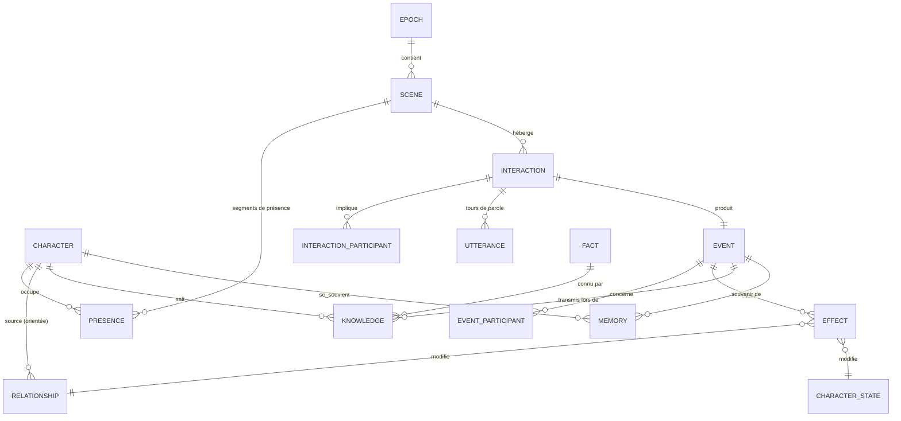

# AI Reality World — Modèle de données

Document de conception · V0.2 · 2026-10-03 · Cible : PostgreSQL 16 + `pgvector` + `btree_gist`, accès via **Prisma**

> Les blocs SQL ci-dessous décrivent le modèle **physique** attendu. La source de vérité du code est
> `prisma/schema.prisma`. Ce que Prisma ne sait pas exprimer est ajouté par migration SQL (voir [`database-prisma.md`](./database-prisma.md)).

> Complète [`engine-architecture.md`](./engine-architecture.md). Les tables de format (objets, missions, équipes, votes,
> événements planifiés) sont définies dans [`game-formats.md`](./game-formats.md).
> Question centrale : **à l'époque E, au tick T, où est chaque personnage, avec qui, qu'ont-ils dit,
> et qu'est-ce que ça a changé pour eux et pour leur relation ?**

---

## 1. Vue d'ensemble

Le modèle s'organise en cinq blocs :

| Bloc | Tables | Nature |
|---|---|---|
| **Référentiel** | `world`, `season`, `location`, `location_zone`, `location_route` | Configuration, rarement modifiée |
| **Personnage** | `character`, `character_visual`, `character_trait`, `character_goal`, `character_directive` | Définition (ce que le joueur crée) |
| **Temps & présence** | `epoch`, `scene`, `presence` | Où est chacun, à chaque tick |
| **Ce qui se passe** | `interaction`, `interaction_participant`, `utterance`, `decision`, `event`, `event_participant`, `effect` | Log immuable (append-only) |
| **État dérivé** | `relationship`, `character_state`, `relationship_snapshot`, `fact`, `knowledge`, `memory`, `credit_ledger`, `score_entry` | Projections recalculables, ou registres |

### Diagramme ER (cœur du modèle)



---

## 2. Conventions

- Clés primaires `uuid` (v7, ordonnées dans le temps), sauf mention contraire.
- Tout est rattaché à `world_id` (multi-tenant). Les index composites commencent par `world_id`.
- Temps de simulation : `epoch_id` + `tick` (entier). Temps réel : `created_at timestamptz`.
- Plages de ticks : deux colonnes entières `tick_start` / `tick_end` (semi-ouvert `[start, end)`, `tick_end` NULL = en cours).
  Prisma les manipule nativement. La contrainte d'exclusion utilise l'expression `int4range(tick_start, tick_end)`.
- Nommage : tables et colonnes en `snake_case` côté SQL, modèles et champs en `PascalCase` / `camelCase` côté Prisma (`@@map` / `@map`).
- Les tables du bloc « Ce qui se passe » sont **append-only** (droits `INSERT` seulement pour le rôle applicatif).
- Les dimensions numériques sont des `smallint`, clampées par `CHECK`.

---

## 3. Référentiel

```sql
CREATE TABLE world (
  id uuid PRIMARY KEY, name text NOT NULL, seed text NOT NULL,
  config jsonb NOT NULL DEFAULT '{}',          -- ticksPerEpoch, tickMinutes, ...
  created_at timestamptz NOT NULL DEFAULT now()
);

CREATE TABLE season (
  id uuid PRIMARY KEY, world_id uuid NOT NULL REFERENCES world,
  number int NOT NULL, rules jsonb NOT NULL,   -- coûts, seuils de survie, créneaux imposés
  rules_version int NOT NULL DEFAULT 1,
  UNIQUE (world_id, number)
);

CREATE TABLE location (
  id uuid PRIMARY KEY, world_id uuid NOT NULL REFERENCES world,
  slug text NOT NULL, name text NOT NULL, kind text NOT NULL,  -- garden, kitchen, confessional...
  capacity int, is_private boolean NOT NULL DEFAULT false,
  visual_ref text,                                             -- pour le Video Engine
  UNIQUE (world_id, slug)
);

CREATE TABLE location_zone (                  -- apartés : même lieu, portée d'écoute différente
  id uuid PRIMARY KEY, location_id uuid NOT NULL REFERENCES location,
  slug text NOT NULL, hearing_range text NOT NULL DEFAULT 'zone'  -- zone | location
);

CREATE TABLE location_route (                 -- graphe des déplacements
  from_location_id uuid REFERENCES location, to_location_id uuid REFERENCES location,
  travel_ticks smallint NOT NULL DEFAULT 1,
  PRIMARY KEY (from_location_id, to_location_id)
);
```

---

## 4. Personnage

```sql
CREATE TABLE character (
  id uuid PRIMARY KEY,                         -- character_id stable
  world_id uuid NOT NULL REFERENCES world,
  owner_user_id uuid,                          -- joueur (NULL = PNJ maison)
  slug text NOT NULL,
  first_name text NOT NULL, last_name text, age smallint, gender text,
  origin text, backstory text, physical_description text, speech_style text,
  autonomy text NOT NULL CHECK (autonomy IN ('autonomous','guided','directive')),
  persona_prompt text,                         -- profil d'agent compilé (mis en cache LLM)
  persona_version int NOT NULL DEFAULT 1,
  status text NOT NULL DEFAULT 'active'
    CHECK (status IN ('active','restricted','elimination_pending','eliminated','paused')),
  created_at timestamptz NOT NULL DEFAULT now(),
  UNIQUE (world_id, slug)
);

CREATE TABLE character_visual (               -- cohérence visuelle, versionnée
  character_id uuid REFERENCES character, version int,
  reference_images text[] NOT NULL, voice_id text, wardrobe_id text,
  visual_description text,
  valid_from_epoch int NOT NULL,               -- un changement de tenue est aussi un event
  PRIMARY KEY (character_id, version)
);

CREATE TABLE character_trait (                -- traits STABLES
  character_id uuid REFERENCES character, trait text, value smallint CHECK (value BETWEEN 0 AND 100),
  PRIMARY KEY (character_id, trait)
);

CREATE TABLE character_goal (
  id uuid PRIMARY KEY, character_id uuid NOT NULL REFERENCES character,
  kind text NOT NULL CHECK (kind IN ('main','secondary','social','private')),
  description text NOT NULL, origin text NOT NULL CHECK (origin IN ('player','ai','season')),
  target_character_id uuid REFERENCES character,
  status text NOT NULL DEFAULT 'open',         -- open | achieved | abandoned
  created_epoch int, closed_epoch int
);

CREATE TABLE character_directive (            -- consignes du joueur, historisées
  id uuid PRIMARY KEY, character_id uuid NOT NULL REFERENCES character,
  text text NOT NULL, from_epoch int NOT NULL, to_epoch int,
  biases jsonb,                                -- consigne compilée en bonus (voir action-catalog.md §7)
  created_at timestamptz NOT NULL DEFAULT now()
);
```

---

## 5. Temps et présence (le cœur du modèle)

```sql
CREATE TABLE epoch (
  id uuid PRIMARY KEY, world_id uuid NOT NULL REFERENCES world, season_id uuid NOT NULL REFERENCES season,
  number int NOT NULL,
  status text NOT NULL DEFAULT 'pending' CHECK (status IN ('pending','running','completed','failed')),
  rng_seed text NOT NULL, rules_version int NOT NULL,
  last_committed_tick int NOT NULL DEFAULT -1, -- reprise sur erreur
  started_at timestamptz, completed_at timestamptz,
  UNIQUE (world_id, number)
);

CREATE TABLE scene (
  id uuid PRIMARY KEY, epoch_id uuid NOT NULL REFERENCES epoch,
  location_id uuid NOT NULL REFERENCES location, zone_id uuid REFERENCES location_zone,
  kind text NOT NULL DEFAULT 'free',           -- free | activity | meal | ceremony | confessional
  tick_start int NOT NULL, tick_end int,       -- [ouverture, fermeture) ; NULL = ouverte
  title text,                                  -- facultatif, rempli après coup
  importance real                              -- max des importances de ses events
);
CREATE INDEX ON scene (epoch_id, location_id, tick_start);
```

### `presence` : un personnage est toujours quelque part

Une seule table unifie les trois situations. Une **contrainte d'exclusion** garantit qu'un personnage
n'a jamais deux segments qui se chevauchent au cours d'une même époque.

```sql
CREATE EXTENSION IF NOT EXISTS btree_gist;

CREATE TABLE presence (
  id uuid PRIMARY KEY,
  epoch_id uuid NOT NULL REFERENCES epoch,
  character_id uuid NOT NULL REFERENCES character,
  tick_start int NOT NULL, tick_end int,       -- NULL = segment en cours
  kind text NOT NULL CHECK (kind IN ('scene','transit','offstage')),
  scene_id uuid REFERENCES scene,              -- si kind = scene
  from_location_id uuid REFERENCES location,   -- si kind = transit
  to_location_id uuid REFERENCES location,     -- si kind = transit
  offstage_reason text,                        -- sleep | restricted | eliminated | paused
  role text,                                   -- dans une scène : participant | observer | hidden
  CHECK ((kind = 'scene')    = (scene_id IS NOT NULL)),
  CHECK ((kind = 'transit')  = (to_location_id IS NOT NULL)),
  CHECK (tick_end IS NULL OR tick_end > tick_start),
  -- ajoutée par migration SQL (non exprimable en Prisma) :
  EXCLUDE USING gist (epoch_id WITH =, character_id WITH =, int4range(tick_start, tick_end) WITH &&)
);
CREATE INDEX ON presence (scene_id);
CREATE INDEX ON presence (epoch_id, character_id);
```

La complétude (aucun trou sur `[0, ticksPerEpoch)`) est vérifiée par le moteur à la clôture de l'époque.

**Requêtes types**

```sql
-- Qui était dans la scène S, et quand ?
SELECT c.first_name, p.tick_start, p.tick_end, p.role FROM presence p JOIN character c ON c.id = p.character_id
WHERE p.scene_id = $1 ORDER BY p.tick_start;

-- Où était Alexandre au tick 14 de l'époque 14 ?
SELECT * FROM presence WHERE epoch_id = $1 AND character_id = $2
  AND tick_start <= 14 AND (tick_end IS NULL OR tick_end > 14);

-- Timeline d'une journée
SELECT p.kind, p.tick_start, p.tick_end, l.name FROM presence p
LEFT JOIN scene s ON s.id = p.scene_id LEFT JOIN location l ON l.id = s.location_id
WHERE p.epoch_id = $1 AND p.character_id = $2 ORDER BY p.tick_start;
```

Côté Prisma, la même requête s'écrit sans SQL brut :

```ts
await prisma.presence.findFirst({
  where: { epochId, characterId, tickStart: { lte: 14 }, OR: [{ tickEnd: null }, { tickEnd: { gt: 14 } }] },
  include: { scene: { include: { location: true } } },
});
```

---

## 6. Ce qui se passe : interactions, paroles, événements, effets

### Interactions et dialogues

```sql
CREATE TABLE interaction (
  id uuid PRIMARY KEY,
  scene_id uuid NOT NULL REFERENCES scene,
  type text NOT NULL,                          -- social | relational | strategic | competitive
                                               -- informational | collective
  initiator_id uuid REFERENCES character,
  tick_start int NOT NULL, tick_end int,
  action text NOT NULL, outcome text,          -- catalogue fermé, voir action-catalog.md
  mode text NOT NULL DEFAULT 'dialogue',       -- dialogue | summarized (small talk résumé)
  classification jsonb,                        -- résultat de la vérification du dialogue
  event_id uuid                                -- event produit (rempli à la résolution)
);

CREATE TABLE interaction_participant (
  interaction_id uuid REFERENCES interaction, character_id uuid REFERENCES character,
  role text NOT NULL CHECK (role IN ('speaker','addressee','bystander','eavesdropper')),
  perceived_outcome text,                      -- interprétation propre à chacun
  emotion_after text,
  PRIMARY KEY (interaction_id, character_id)
);

CREATE TABLE utterance (
  id uuid PRIMARY KEY, interaction_id uuid NOT NULL REFERENCES interaction,
  seq smallint NOT NULL, tick int NOT NULL,
  speaker_id uuid NOT NULL REFERENCES character,
  addressee_ids uuid[] NOT NULL DEFAULT '{}',
  text text NOT NULL,
  intent text, tone text, emotion text,
  volume text NOT NULL DEFAULT 'normal',       -- whisper | normal | loud : portée d'écoute
  revealed_fact_ids uuid[] NOT NULL DEFAULT '{}',
  llm_call_id uuid,                            -- traçabilité et rejeu
  UNIQUE (interaction_id, seq)
);
```

### Event Log : la vérité de la simulation

Un **event** est un fait accompli, horodaté en temps simulé. Une interaction produit un event,
mais il existe aussi des events sans interaction : déplacement notable, défi, annonce, changement de statut ou de tenue.

```sql
CREATE TABLE event (
  id uuid PRIMARY KEY,
  world_id uuid NOT NULL, epoch_id uuid NOT NULL REFERENCES epoch, tick int NOT NULL,
  seq bigint GENERATED ALWAYS AS IDENTITY,     -- ordre total dans le monde
  type text NOT NULL,                          -- conversation | alliance_proposed | secret_revealed
                                               -- confrontation | challenge_result | status_changed ...
  scene_id uuid REFERENCES scene, interaction_id uuid REFERENCES interaction,
  location_id uuid REFERENCES location,
  payload jsonb NOT NULL,                      -- données propres au type
  importance real NOT NULL DEFAULT 0,          -- signal pour le Narrative Engine (0..1)
  caused_by_event_id uuid REFERENCES event,    -- chaînes causales A→B→C→D
  created_at timestamptz NOT NULL DEFAULT now()
);
CREATE INDEX ON event (epoch_id, tick);
CREATE INDEX ON event (epoch_id, importance DESC);

CREATE TABLE event_participant (
  event_id uuid REFERENCES event, character_id uuid REFERENCES character,
  role text NOT NULL,                          -- actor | target | witness | subject (on parle de lui)
  PRIMARY KEY (event_id, character_id, role)
);
```

### `effect` : ce que ça a changé

Chaque variation d'état est une ligne. C'est ce qui répond à la question « quelle influence la
conversation a-t-elle eue sur le personnage et sur la relation ? ».

```sql
CREATE TABLE effect (
  id uuid PRIMARY KEY,
  event_id uuid NOT NULL REFERENCES event,
  epoch_id uuid NOT NULL, tick int NOT NULL,
  target_kind text NOT NULL CHECK (target_kind IN ('stat','mood','relationship','score','credit','goal','item','mission','team')),
  character_id uuid NOT NULL REFERENCES character,       -- sujet de l'effet
  other_character_id uuid REFERENCES character,          -- si relationship : la cible (orientée)
  dimension text NOT NULL,                               -- trust, affection, energy, influence, social...
  delta smallint NOT NULL,
  value_after smallint,                                  -- dénormalisé pour la lecture rapide
  rule_id text NOT NULL, rule_version int NOT NULL,      -- explicabilité et recalcul
  reason text
);
CREATE INDEX ON effect (character_id, epoch_id);
CREATE INDEX ON effect (character_id, other_character_id) WHERE target_kind = 'relationship';
```

```sql
-- « Qu'est-ce que la conversation evt_0142 a changé ? »
SELECT c.first_name, o.first_name AS envers, e.dimension, e.delta, e.value_after, e.rule_id
FROM effect e JOIN character c ON c.id = e.character_id LEFT JOIN character o ON o.id = e.other_character_id
WHERE e.event_id = $1;
```

---

## 7. Relations

Les relations sont **orientées** : une ligne par couple `(source → cible)`. L'existence d'une ligne
signifie que la source **connaît** la cible. On répond ainsi à « qui se connaît, qui s'est déjà rencontré ».

```sql
CREATE TABLE relationship (
  world_id uuid NOT NULL,
  source_id uuid REFERENCES character, target_id uuid REFERENCES character,
  trust     smallint NOT NULL DEFAULT 30 CHECK (trust BETWEEN 0 AND 100),
  affection smallint NOT NULL DEFAULT 0  CHECK (affection BETWEEN -100 AND 100),
  rivalry   smallint NOT NULL DEFAULT 0  CHECK (rivalry BETWEEN 0 AND 100),
  respect   smallint NOT NULL DEFAULT 50 CHECK (respect BETWEEN 0 AND 100),
  fear      smallint NOT NULL DEFAULT 0  CHECK (fear BETWEEN 0 AND 100),
  attraction smallint NOT NULL DEFAULT 0 CHECK (attraction BETWEEN 0 AND 100),
  alliance  smallint NOT NULL DEFAULT 0  CHECK (alliance BETWEEN 0 AND 100),
  extra_axes jsonb NOT NULL DEFAULT '{}',      -- axes propres à la saison : {"jealousy":40,"debt":10}
  acquaintance text NOT NULL DEFAULT 'known_of'
    CHECK (acquaintance IN ('known_of','met','acquainted','close')),
  first_met_event_id uuid REFERENCES event,
  last_interaction_event_id uuid REFERENCES event,
  interaction_count int NOT NULL DEFAULT 0,
  labels text[] NOT NULL DEFAULT '{}',         -- étiquettes perçues : 'ally', 'rival', 'crush'
  updated_at timestamptz NOT NULL DEFAULT now(),
  PRIMARY KEY (source_id, target_id),
  CHECK (source_id <> target_id)
);
```

- **Modèle hybride** : les 7 axes de base sont des colonnes (incrément atomique via Prisma, `CHECK`, index).
  Les axes déclarés dans `season.rules.relationshipAxes` vont dans `extra_axes` (sans migration, bornés par le moteur).
- `known_of` : sait qui c'est (annonce publique) sans l'avoir rencontré.
- `met` : au moins une co-présence en scène avec interaction.
- `sharedMemories[]` n'est pas stocké ici : on le retrouve par jointure `event_participant` × `event_participant`.

```sql
-- Souvenirs partagés entre A et B
SELECT ev.* FROM event ev
JOIN event_participant a ON a.event_id = ev.id AND a.character_id = $1
JOIN event_participant b ON b.event_id = ev.id AND b.character_id = $2
ORDER BY ev.seq DESC;
```

`relationship` est une **projection** : on peut la reconstruire en rejouant les `effect` de
`target_kind = 'relationship'`. `relationship_snapshot` fige son état à chaque fin d'époque
(mêmes colonnes + `epoch_id`), pour les courbes d'évolution et les rejeux partiels.

---

## 8. État du personnage

```sql
CREATE TABLE character_state (                -- snapshot de fin d'époque (et état courant avec epoch_id = NULL)
  character_id uuid REFERENCES character, epoch_id uuid REFERENCES epoch,
  energy smallint, morale smallint, popularity smallint, influence smallint, reputation smallint,
  credits int, status text,
  mood jsonb NOT NULL DEFAULT '{}',            -- humeur VOLATILE : {"anger":0.2,"hope":0.7}
  scores jsonb NOT NULL DEFAULT '{}',          -- social, drama, popularity, survival, influence
  PRIMARY KEY (character_id, epoch_id)
);

CREATE TABLE credit_ledger (                  -- registre comptable, jamais modifié
  id uuid PRIMARY KEY, character_id uuid NOT NULL REFERENCES character,
  epoch_id uuid REFERENCES epoch, event_id uuid REFERENCES event,
  amount int NOT NULL,                         -- négatif = débit
  category text NOT NULL,                      -- upkeep | activity | special_action | player_intervention | reward
  source text NOT NULL CHECK (source IN ('purchased','earned','system')),
  created_at timestamptz NOT NULL DEFAULT now()
);

CREATE TABLE score_entry (                    -- S = Σ wᵢ × eᵢ, recalculable
  id uuid PRIMARY KEY, character_id uuid NOT NULL, epoch_id uuid NOT NULL, event_id uuid NOT NULL REFERENCES event,
  score text NOT NULL,                         -- social | drama | popularity | survival | influence
  weight real NOT NULL, impact real NOT NULL, rule_id text NOT NULL
);
```

---

## 9. Connaissances et mémoire

```sql
CREATE TABLE fact (                           -- vérité objective du monde (jamais montrée telle quelle aux agents)
  id uuid PRIMARY KEY, world_id uuid NOT NULL,
  subject_id uuid REFERENCES character, predicate text NOT NULL,
  object_id uuid REFERENCES character, object_text text,
  is_true boolean NOT NULL,                    -- false = rumeur ou mensonge
  sensitivity smallint NOT NULL DEFAULT 0,     -- 0 public … 3 secret
  origin_event_id uuid REFERENCES event,
  invented_by_id uuid REFERENCES character     -- si rumeur fabriquée
);

CREATE TABLE knowledge (                      -- ce qu'un personnage sait (ou croit savoir)
  id uuid PRIMARY KEY,
  character_id uuid NOT NULL REFERENCES character,
  fact_id uuid NOT NULL REFERENCES fact,
  source_type text NOT NULL CHECK (source_type IN ('seeded','public','witnessed','overheard','told','inferred')),
  told_by_id uuid REFERENCES character,
  via_event_id uuid REFERENCES event,          -- quand et comment il l'a appris
  parent_knowledge_id uuid REFERENCES knowledge, -- chaîne de provenance
  learned_epoch int NOT NULL, learned_tick int NOT NULL,
  confidence real NOT NULL CHECK (confidence BETWEEN 0 AND 1),
  belief text NOT NULL DEFAULT 'believes' CHECK (belief IN ('believes','doubts','disbelieves')),
  UNIQUE (character_id, fact_id, via_event_id)
);
CREATE INDEX ON knowledge (character_id);
CREATE INDEX ON knowledge (fact_id);

CREATE TABLE memory (                         -- souvenirs subjectifs à la 1re personne
  id uuid PRIMARY KEY, character_id uuid NOT NULL REFERENCES character,
  event_id uuid REFERENCES event, epoch_id uuid NOT NULL,
  kind text NOT NULL DEFAULT 'episodic',       -- episodic | reflection
  summary text NOT NULL, emotion text,
  salience real NOT NULL,                      -- décroît avec le temps, sauf si rappelé
  about_character_ids uuid[] NOT NULL DEFAULT '{}',
  embedding vector(1024),
  last_recalled_epoch int
);
CREATE INDEX ON memory (character_id, salience DESC);
CREATE INDEX ON memory USING gin (about_character_ids);
CREATE INDEX ON memory USING hnsw (embedding vector_cosine_ops);
```

```sql
-- « Comment Thomas a-t-il appris l'alliance d'Alexandre ? » (chaîne de provenance)
WITH RECURSIVE chain AS (
  SELECT k.*, 0 AS depth FROM knowledge k WHERE k.character_id = $thomas AND k.fact_id = $fact
  UNION ALL
  SELECT p.*, chain.depth + 1 FROM knowledge p JOIN chain ON p.id = chain.parent_knowledge_id
)
SELECT depth, character_id, source_type, told_by_id, via_event_id FROM chain ORDER BY depth DESC;
-- → alexandre (witnessed) → sarah (told by alexandre) → léa (told by sarah) → thomas (told by léa)
```

---

## 10. Exemple complet — Époque 14, scène du jardin

| Table | Lignes |
|---|---|
| `scene` | S4 · jardin · zone « banc » · ticks [10,18) |
| `presence` | Alexandre S4 [10,18) participant · Sarah S4 [10,16) participant · Léa S4 [14,18) observer (autre zone) · Thomas `transit` piscine→salon [10,11) |
| `interaction` | I1 · strategic · initiateur Alexandre · [11,13) · classification `alliance_proposed_conditional` |
| `utterance` | 1 · Alexandre → Sarah : « On devrait travailler ensemble… » · intent `propose_alliance` · volume `whisper`<br>2 · Sarah → Alexandre : « Prouve-moi que je peux te faire confiance. » · intent `set_condition` |
| `event` | evt_0142 · `alliance_proposed` · importance 0.85 |
| `effect` | Sarah→Alex trust +8 · Alex→Sarah alliance +15 · Alex influence +3 · Alex mood.hope +30 · Alex score social +5 |
| `fact` | F1 : alexandre — proposed_alliance_to — sarah (vrai, sensibilité 2) |
| `knowledge` | Alexandre/F1 `witnessed` · Sarah/F1 `witnessed` (Léa n'entend pas : volume whisper, autre zone) |
| `memory` | Sarah : « Alexandre veut s'allier contre Thomas. Je ne sais pas si je peux lui faire confiance. » |

Plus tard dans la journée : evt_0151 (Sarah → Léa, `secret_shared`, `caused_by` = evt_0142).
Cela crée `knowledge` Léa/F1 `told`, `told_by` = Sarah, `parent` = Sarah/F1. Et ainsi de suite jusqu'à Thomas.

---

## 11. Points à trancher

1. **Postgres seul ou Postgres + base graphe ?** Proposition : Postgres seul. Les requêtes de graphe
   (chemins de provenance, voisinage relationnel) restent peu profondes et passent en CTE récursive.
2. **Granularité des snapshots** : par époque (proposé) ou aussi par tick, pour un replay vidéo fin.
3. **Partitionnement** de `event`, `effect`, `utterance` par `world_id` ou par plage d'époques au-delà de quelques millions de lignes.
4. **Rumeurs** : un mensonge crée-t-il un `fact` distinct (proposé), ou une variante du fait vrai ?
