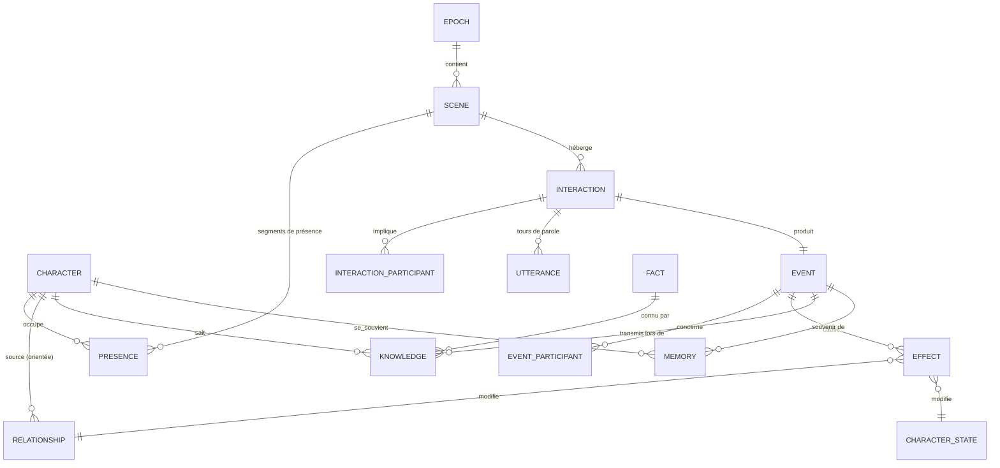

# AI Reality World — Modèle de données

Document de conception · V0.2 · 2026-10-03 · Cible : PostgreSQL 16 + `pgvector` + `btree_gist`, accès via **Prisma**

> Ce document décrit les **intentions** et les **contraintes** du modèle. La source de vérité des colonnes est le schéma
> Prisma ([`packages/storage-prisma/prisma/schema/`](../packages/storage-prisma/prisma/schema/)) ; ce que Prisma ne sait pas
> exprimer est dans la migration `constraints` (voir [`database-prisma.md`](./database-prisma.md)). Aucune définition de
> table n'est recopiée ici, pour éviter toute dérive.

> Complète [`engine-architecture.md`](./engine-architecture.md). Les tables de format (objets, missions, équipes, votes,
> événements planifiés) sont définies dans [`game-formats.md`](./game-formats.md).
> Question centrale : **à l'époque E, au tick T, où est chaque personnage, avec qui, qu'ont-ils dit,
> et qu'est-ce que ça a changé pour eux et pour leur relation ?**

---

## 1. Vue d'ensemble

Le modèle s'organise en cinq blocs :

| Bloc | Tables | Nature |
|---|---|---|
| **Référentiel** | `world`, `season`, `location`, `location_zone`, `location_route` | Configuration, rarement modifiée |
| **Personnage** | `character`, `character_visual`, `character_trait`, `character_goal`, `character_directive` | Définition (ce que le joueur crée) |
| **Temps & présence** | `epoch`, `scene`, `presence` | Où est chacun, à chaque tick |
| **Ce qui se passe** | `interaction`, `interaction_participant`, `utterance`, `decision`, `event`, `event_participant`, `effect` | Log immuable (append-only) |
| **État dérivé** | `relationship`, `character_state`, `relationship_snapshot`, `fact`, `knowledge`, `memory`, `credit_ledger`, `score_entry` | Projections recalculables, ou registres |

### Diagramme ER (cœur du modèle)



---

## 2. Conventions

- Clés primaires `uuid` (v7, ordonnées dans le temps), sauf mention contraire.
- Tout est rattaché à `world_id` (multi-tenant). Les index composites commencent par `world_id`.
- Temps de simulation : `epoch_id` + `tick` (entier). Temps réel : `created_at timestamptz`.
- Plages de ticks : deux colonnes entières `tick_start` / `tick_end` (semi-ouvert `[start, end)`, `tick_end` NULL = en cours).
  Prisma les manipule nativement. La contrainte d'exclusion utilise l'expression `int4range(tick_start, tick_end)`.
- Nommage : tables et colonnes en `snake_case` côté SQL, modèles et champs en `PascalCase` / `camelCase` côté Prisma (`@@map` / `@map`).
- Les tables du bloc « Ce qui se passe » sont **append-only** (droits `INSERT` seulement pour le rôle applicatif).
- Les dimensions numériques sont des `smallint`, clampées par `CHECK`.

---

## 3. Référentiel

Schéma : [`02-referentiel.prisma`](../packages/storage-prisma/prisma/schema/02-referentiel.prisma).

| Table | Rôle | Contraintes et invariants |
|---|---|---|
| `world` | Monde (multi-tenant), graine, `config` (ticks par époque, durée d'un tick…) | — |
| `season` | Saison d'un monde : `rules` (économie, axes de relation, poids des scores), `format`, `rules_version` | `(world_id, number)` unique |
| `location` | Lieu du graphe (`kind` : garden, kitchen, confessional…), capacité, lieu privé, `visual_ref` | `(world_id, slug)` unique |
| `location_zone` | Sous-partie d'un lieu pour les apartés ; `hearing_range` = `zone` ou `location` | — |
| `location_route` | Arête orientée du graphe des déplacements, `travel_ticks` | clé `(from, to)` |

---

## 4. Personnage

Schéma : [`03-personnage.prisma`](../packages/storage-prisma/prisma/schema/03-personnage.prisma).

| Table | Rôle | Contraintes et invariants |
|---|---|---|
| `character` | Identité stable (`character_id`), joueur propriétaire (NULL = PNJ), `autonomy`, profil d'agent compilé (`persona_prompt`, `persona_version`), `status` | `(world_id, slug)` unique ; `autonomy` et `status` en enums fermés |
| `character_visual` | Cohérence visuelle versionnée (images, voix, garde-robe), valable à partir d'une époque | clé `(character_id, version)` ; un changement de tenue est aussi un event |
| `character_trait` | Traits **stables** pendant une époque | clé `(character_id, trait)` ; valeur dans 0..100 (`CHECK`) |
| `character_goal` | Objectifs `main` / `secondary` / `social` / `private`, d'origine `player`, `ai` ou `season` (missions) | — |
| `character_directive` | Consignes du joueur historisées par plage d'époques, et leur compilation en `biases` (voir `action-catalog.md` §7) | — |

---

## 5. Temps et présence (le cœur du modèle)

Schéma : [`04-temps.prisma`](../packages/storage-prisma/prisma/schema/04-temps.prisma).

| Table | Rôle | Contraintes et invariants |
|---|---|---|
| `epoch` | Une journée simulée : statut, graine du RNG, version des règles, `last_committed_tick` pour la reprise | `(world_id, number)` unique |
| `scene` | Unité de co-présence : un lieu (et une zone), une plage `[tick_start, tick_end)`, un `kind` (free, activity, meal…), `importance` | `tick_end > tick_start` (`CHECK`) ; index `(epoch_id, location_id, tick_start)` |

### `presence` : un personnage est toujours quelque part

Une seule table unifie les trois situations. Une **contrainte d'exclusion** garantit qu'un personnage
n'a jamais deux segments qui se chevauchent au cours d'une même époque.

Schéma : [`04-temps.prisma`](../packages/storage-prisma/prisma/schema/04-temps.prisma), contraintes dans la migration [`constraints`](../packages/storage-prisma/prisma/schema/migrations).

| Règle | Mise en œuvre |
|---|---|
| Un `kind` parmi `scene`, `transit`, `offstage` | enum |
| `kind = scene` ⇔ `scene_id` renseigné | `CHECK` |
| `kind = transit` ⇔ `to_location_id` renseigné | `CHECK` |
| `tick_end` NULL (en cours) ou `> tick_start` | `CHECK` |
| Aucun chevauchement pour un même personnage dans une époque | `EXCLUDE USING gist (epoch_id =, character_id =, int4range(tick_start, tick_end) &&)` |
| Dans une scène, `role` : `participant`, `observer` ou `hidden` ; hors-jeu, `offstage_reason` : sleep, restricted, eliminated, paused | applicatif |

La complétude (aucun trou sur `[0, ticksPerEpoch)`) est vérifiée par le moteur à la clôture de l'époque.

**Requêtes types**

```sql
-- Qui était dans la scène S, et quand ?
SELECT c.first_name, p.tick_start, p.tick_end, p.role FROM presence p JOIN character c ON c.id = p.character_id
WHERE p.scene_id = $1 ORDER BY p.tick_start;

-- Où était Alexandre au tick 14 de l'époque 14 ?
SELECT * FROM presence WHERE epoch_id = $1 AND character_id = $2
  AND tick_start <= 14 AND (tick_end IS NULL OR tick_end > 14);

-- Timeline d'une journée
SELECT p.kind, p.tick_start, p.tick_end, l.name FROM presence p
LEFT JOIN scene s ON s.id = p.scene_id LEFT JOIN location l ON l.id = s.location_id
WHERE p.epoch_id = $1 AND p.character_id = $2 ORDER BY p.tick_start;
```

Côté Prisma, la même requête s'écrit sans SQL brut :

```ts
await prisma.presence.findFirst({
  where: { epochId, characterId, tickStart: { lte: 14 }, OR: [{ tickEnd: null }, { tickEnd: { gt: 14 } }] },
  include: { scene: { include: { location: true } } },
});
```

---

## 6. Ce qui se passe : interactions, paroles, événements, effets

### Interactions et dialogues

Schéma : [`05-evenements.prisma`](../packages/storage-prisma/prisma/schema/05-evenements.prisma).

| Table | Rôle | Contraintes et invariants |
|---|---|---|
| `interaction` | Une interaction dans une scène : `type`, initiateur, plage de ticks, `action` et `outcome` du catalogue fermé, `mode` (`dialogue` ou `summarized`), `classification` (résultat de la vérification) | `action` et `outcome` validés par le moteur contre `action-catalog.md` ; l'event produit pointe vers l'interaction (`event.interaction_id` unique) |
| `interaction_participant` | Rôle de chacun (`speaker`, `addressee`, `bystander`, `eavesdropper`), issue perçue, émotion après | clé `(interaction_id, character_id)` |
| `utterance` | Tours de parole : texte, intention, ton, émotion, `volume` (portée d'écoute), faits révélés, appel LLM d'origine | `(interaction_id, seq)` unique ; append-only |

### Event Log : la vérité de la simulation

Un **event** est un fait accompli, horodaté en temps simulé. Une interaction produit un event,
mais il existe aussi des events sans interaction : déplacement notable, défi, annonce, changement de statut ou de tenue.

Schéma : [`05-evenements.prisma`](../packages/storage-prisma/prisma/schema/05-evenements.prisma).

| Table | Rôle | Contraintes et invariants |
|---|---|---|
| `event` | Fait accompli : `type` (conversation, alliance_proposed, secret_revealed, status_changed…), `payload`, `importance` 0..1, `caused_by_event_id` (chaînes causales A→B→C→D) | `seq` unique, attribué par le moteur (ordre total déterministe) ; append-only ; index `(epoch_id, tick)` et `(epoch_id, importance DESC)` |
| `event_participant` | Qui est concerné : `actor`, `target`, `witness`, `subject` | clé `(event_id, character_id, role)` |

### `effect` : ce que ça a changé

Chaque variation d'état est une ligne. C'est ce qui répond à la question « quelle influence la
conversation a-t-elle eue sur le personnage et sur la relation ? ».

Schéma : [`05-evenements.prisma`](../packages/storage-prisma/prisma/schema/05-evenements.prisma).

| Champ | Intention |
|---|---|
| `event_id`, `epoch_id`, `tick` | Toute variation a une cause datée |
| `target_kind` | `stat`, `mood`, `relationship`, `score`, `credit`, `goal`, `item`, `mission`, `team` |
| `character_id`, `other_character_id` | Sujet de l'effet ; cible orientée si c'est une relation |
| `dimension`, `delta`, `value_after` | Ce qui change, de combien, et la valeur après clamp (lecture rapide) |
| `rule_id`, `rule_version` | Explicabilité et recalcul après changement de règles |

Invariants : append-only ; aucune projection ne change sans effect associé.

```sql
-- « Qu'est-ce que la conversation evt_0142 a changé ? »
SELECT c.first_name, o.first_name AS envers, e.dimension, e.delta, e.value_after, e.rule_id
FROM effect e JOIN character c ON c.id = e.character_id LEFT JOIN character o ON o.id = e.other_character_id
WHERE e.event_id = $1;
```

---

## 7. Relations

Les relations sont **orientées** : une ligne par couple `(source → cible)`. L'existence d'une ligne
signifie que la source **connaît** la cible. On répond ainsi à « qui se connaît, qui s'est déjà rencontré ».

Schéma : [`06-relations.prisma`](../packages/storage-prisma/prisma/schema/06-relations.prisma), bornes dans la migration [`constraints`](../packages/storage-prisma/prisma/schema/migrations).

| Règle | Mise en œuvre |
|---|---|
| Une ligne par couple orienté `(source → cible)`, jamais avec soi-même | clé `(source_id, target_id)` ; `CHECK (source_id <> target_id)` |
| 7 axes de base : `trust`, `rivalry`, `respect`, `fear`, `attraction`, `alliance` dans 0..100, `affection` dans −100..100 | `CHECK` ; défauts trust 30, respect 50, autres 0 |
| Axes de saison dans `extra_axes` (jsonb), bornés 0..100 | applicatif (moteur) |
| Niveau de connaissance `acquaintance` : `known_of` → `met` → `acquainted` → `close` | enum |
| Premier contact, dernière interaction, compteur, étiquettes perçues (`ally`, `rival`…) | colonnes dédiées |

- **Modèle hybride** : les 7 axes de base sont des colonnes (incrément atomique via Prisma, `CHECK`, index).
  Les axes déclarés dans `season.rules.relationshipAxes` vont dans `extra_axes` (sans migration, bornés par le moteur).
- `known_of` : sait qui c'est (annonce publique) sans l'avoir rencontré.
- `met` : au moins une co-présence en scène avec interaction.
- `sharedMemories[]` n'est pas stocké ici : on le retrouve par jointure `event_participant` × `event_participant`.

```sql
-- Souvenirs partagés entre A et B
SELECT ev.* FROM event ev
JOIN event_participant a ON a.event_id = ev.id AND a.character_id = $1
JOIN event_participant b ON b.event_id = ev.id AND b.character_id = $2
ORDER BY ev.seq DESC;
```

`relationship` est une **projection** : on peut la reconstruire en rejouant les `effect` de
`target_kind = 'relationship'`. `relationship_snapshot` fige son état à chaque fin d'époque
(mêmes colonnes + `epoch_id`), pour les courbes d'évolution et les rejeux partiels.

---

## 8. État du personnage

Schéma : [`06-relations.prisma`](../packages/storage-prisma/prisma/schema/06-relations.prisma).

| Table | Rôle | Contraintes et invariants |
|---|---|---|
| `character_state` | État par personnage et par époque : stats (energy, morale, popularity, influence, reputation), crédits, statut, humeur **volatile**, scores ; écrit à chaque tick (état courant) et figé en fin d'époque. `runtime` porte les données de reprise (agenda, position) | clé `(character_id, epoch_id)` : l'état courant est la ligne de l'époque en cours |
| `credit_ledger` | Registre comptable : montant (négatif = débit), catégorie (upkeep, activity, special_action, player_intervention, reward), `source` (`purchased`, `earned`, `system`) | append-only ; `C_fin = C_début − Σ débits + Σ crédits` |
| `score_entry` | Contributions aux scores : `S = Σ poids × impact`, avec la règle d'origine | recalculable quand les poids changent |
| `relationship_snapshot` | Relations figées en fin d'époque (courbes, rejeux partiels) | mêmes bornes que `relationship` |

---

## 9. Connaissances et mémoire

Schéma : [`07-connaissances.prisma`](../packages/storage-prisma/prisma/schema/07-connaissances.prisma), index dans la migration [`constraints`](../packages/storage-prisma/prisma/schema/migrations).

| Table | Rôle | Contraintes et invariants |
|---|---|---|
| `fact` | Vérité objective `(sujet, prédicat, objet)`, jamais montrée telle quelle aux agents ; `is_true = false` pour une rumeur ou un mensonge (`invented_by_id`) | `sensitivity` dans 0..3 (0 public … 3 secret) |
| `knowledge` | Ce qu'un personnage sait ou croit : `source_type` (`seeded`, `public`, `witnessed`, `overheard`, `told`, `inferred`), qui le lui a dit, par quel event, maillon parent (`parent_knowledge_id`), confiance, croyance | `confidence` dans 0..1 ; `(character_id, fact_id, via_event_id)` unique ; le contexte d'un agent ne lit **que** cette table |
| `memory` | Souvenir subjectif à la première personne : résumé, émotion, saillance (décroît sauf rappel), personnes concernées, `embedding vector(1024)` | index HNSW (cosinus) et GIN sur `about_character_ids` ; `Unsupported` côté Prisma, accès par `$queryRaw` |

```sql
-- « Comment Thomas a-t-il appris l'alliance d'Alexandre ? » (chaîne de provenance)
WITH RECURSIVE chain AS (
  SELECT k.*, 0 AS depth FROM knowledge k WHERE k.character_id = $thomas AND k.fact_id = $fact
  UNION ALL
  SELECT p.*, chain.depth + 1 FROM knowledge p JOIN chain ON p.id = chain.parent_knowledge_id
)
SELECT depth, character_id, source_type, told_by_id, via_event_id FROM chain ORDER BY depth DESC;
-- → sarah (witnessed, témoin direct de la proposition) → léa (told by sarah) → thomas (told by léa)
-- Alexandre, autre témoin direct, a sa propre chaîne à un maillon (cohérent avec l'exemple §10).
```

---

## 10. Exemple complet — Époque 14, scène du jardin

| Table | Lignes |
|---|---|
| `scene` | S4 · jardin · zone « banc » · ticks [10,18) |
| `presence` | Alexandre S4 [10,18) participant · Sarah S4 [10,16) participant · Léa S4 [14,18) observer (autre zone) · Thomas `transit` piscine→salon [10,11) |
| `interaction` | I1 · strategic · initiateur Alexandre · [11,13) · classification `alliance_proposed_conditional` |
| `utterance` | 1 · Alexandre → Sarah : « On devrait travailler ensemble… » · intent `propose_alliance` · volume `whisper`<br>2 · Sarah → Alexandre : « Prouve-moi que je peux te faire confiance. » · intent `set_condition` |
| `event` | evt_0142 · `alliance_proposed` · importance 0.85 |
| `effect` | Sarah→Alex trust +8 · Alex→Sarah alliance +15 · Alex influence +3 · Alex mood.hope +30 · Alex score social +5 |
| `fact` | F1 : alexandre — proposed_alliance_to — sarah (vrai, sensibilité 2) |
| `knowledge` | Alexandre/F1 `witnessed` · Sarah/F1 `witnessed` (Léa n'entend pas : volume whisper, autre zone) |
| `memory` | Sarah : « Alexandre veut s'allier contre Thomas. Je ne sais pas si je peux lui faire confiance. » |

Plus tard dans la journée : evt_0151 (Sarah → Léa, `secret_shared`, `caused_by` = evt_0142).
Cela crée `knowledge` Léa/F1 `told`, `told_by` = Sarah, `parent` = Sarah/F1. Et ainsi de suite jusqu'à Thomas.

---

## 11. Points à trancher

1. **Postgres seul ou Postgres + base graphe ?** Proposition : Postgres seul. Les requêtes de graphe
   (chemins de provenance, voisinage relationnel) restent peu profondes et passent en CTE récursive.
2. **Granularité des snapshots** : par époque (proposé) ou aussi par tick, pour un replay vidéo fin.
3. **Partitionnement** de `event`, `effect`, `utterance` par `world_id` ou par plage d'époques au-delà de quelques millions de lignes.
4. **Rumeurs** : un mensonge crée-t-il un `fact` distinct (proposé), ou une variante du fait vrai ?
