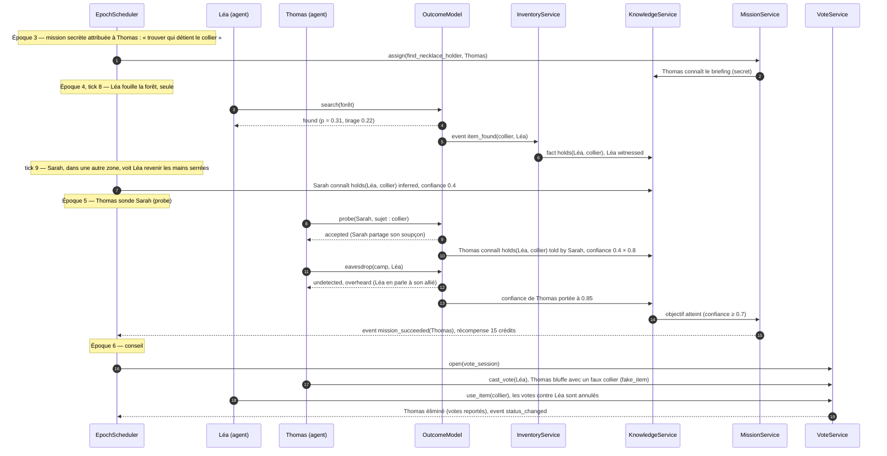

# AI Reality World — Formats de jeu : objets, missions, équipes, votes

Document de conception · V0.1 · 2026-10-03

> Complète [`engine-architecture.md`](./engine-architecture.md), [`database-model.md`](./database-model.md) et
> [`action-catalog.md`](./action-catalog.md). Objectif : faire tourner des formats variés (villa de télé-réalité,
> aventure / survie de type Koh-Lanta, huis clos…) avec **le même moteur**.

---

## 1. Principe : un moteur générique, des formats configurables

Le moteur ne connaît ni « Koh-Lanta » ni « villa ». Il connaît des **briques** :

| Brique | Rôle | Statut |
|---|---|---|
| Lieux, scènes, présence | Où sont les personnages | Existant |
| Relations, connaissances, mémoire | Ce qu'ils pensent et savent | Existant |
| Catalogue d'actions | Ce qu'ils peuvent faire | Existant, étendu ici |
| **Objets** | Ce qu'ils possèdent, cherchent, cachent | **Nouveau** |
| **Missions** | Objectifs vérifiables avec récompense | **Nouveau** |
| **Équipes** | Groupes qui évoluent dans le temps | **Nouveau** |
| **Votes** | Décisions collectives qui éliminent ou désignent | **Nouveau** |
| **Événements planifiés et déclencheurs** | Épreuves, conseils, annonces, surprises | **Nouveau** (remplace les créneaux en jsonb) |

Un **format** est une configuration de saison (`season.format`) qui active et paramètre ces briques.
Exemple complet au §7.

**Règle commune** : comme les relations, toute possession, progression ou appartenance est une **projection des
événements**. On ne modifie jamais directement « qui a le collier ». On écrit un event `item_found`, et la projection suit.

---

## 2. Objets

### 2.1 Modèle

```sql
CREATE TABLE item_def (                        -- le type d'objet
  id uuid PRIMARY KEY, season_id uuid NOT NULL REFERENCES season,
  slug text NOT NULL,                          -- immunity_necklace, totem, food_ration, clue
  name text NOT NULL, description text,
  kind text NOT NULL,                          -- power | resource | clue | cosmetic
  effects jsonb NOT NULL DEFAULT '{}',         -- {"on":"vote_session","nullify_votes_against_holder":true}
  transferable boolean NOT NULL DEFAULT true,
  expires_after_epoch int,                     -- validité (ex. jusqu'au conseil à 5)
  visual_ref text,
  UNIQUE (season_id, slug)
);

CREATE TABLE item (                            -- un exemplaire de l'objet
  id uuid PRIMARY KEY, item_def_id uuid NOT NULL REFERENCES item_def,
  -- projection courante (reconstruite depuis les events) :
  holder_character_id uuid REFERENCES character,
  location_id uuid REFERENCES location,        -- s'il est posé ou caché quelque part
  hidden boolean NOT NULL DEFAULT false,
  search_difficulty smallint CHECK (search_difficulty BETWEEN 0 AND 100),
  is_fake boolean NOT NULL DEFAULT false,      -- faux collier fabriqué par un joueur
  fake_of_item_def_id uuid REFERENCES item_def,
  state text NOT NULL DEFAULT 'active',        -- active | used | expired | destroyed
  CHECK (num_nonnulls(holder_character_id, location_id) <= 1)
);
```

### 2.2 Événements d'objet

`item_placed` (par le format) · `item_found` · `item_picked_up` · `item_given` · `item_traded` · `item_stolen` ·
`item_hidden` · `item_shown` · `item_used` · `item_expired` · `item_faked`

Chacun produit un `effect` de type `item` (champs `dimension = 'holder' | 'location' | 'state'`). Le
`RelationshipService` a son équivalent pour les objets : l'`InventoryService`.

### 2.3 La possession est une connaissance

À chaque changement de main, le moteur crée ou met à jour un fait :
`fact(subject = Léa, predicate = 'holds', object_text = 'item:<id>', is_true = true, sensitivity = 3)`.

- **Le porteur** le sait (`witnessed`).
- **Un témoin** de la fouille ou de l'échange le sait (`witnessed` ou `overheard`, selon la portée).
- **Les autres** l'apprennent par `share_secret`, `show_item`, une rumeur… ou pas du tout.
- **Un faux objet** crée un fait faux : `holds(Thomas, item:<faux>)` est vrai, mais Thomas peut faire croire qu'il s'agit du vrai collier.
  Le fait `holds(Thomas, immunity_necklace)` est alors **faux** (`is_true = false`, `invented_by = Thomas`).

« Rechercher qui possède le collier » devient une question de **connaissance**, déjà gérée avec sa provenance et son degré de confiance.

### 2.4 Fouille

`search(location)` est une action comme les autres. Son issue (`found` / `not_found` / `found_clue`) est tirée par
l'`OutcomeModel` :

```
P(found) = σ( a·(énergie/100) + b·perspicacité − c·difficulté + d·indices connus sur ce lieu − e·fouilles déjà faites )
```

Un **indice** (`clue`) est un objet qui, une fois trouvé, crée une connaissance sur l'emplacement de l'objet principal
(« le collier est près du grand arbre »). Il augmente donc `P(found)` pour celui qui le possède.

---

## 3. Missions

### 3.1 Modèle

```sql
CREATE TABLE mission_def (
  id uuid PRIMARY KEY, season_id uuid NOT NULL REFERENCES season,
  slug text NOT NULL, title text NOT NULL, briefing text NOT NULL, -- texte donné à l'agent
  scope text NOT NULL CHECK (scope IN ('individual','team','all')),
  secrecy text NOT NULL CHECK (secrecy IN ('public','private','secret')),
  objective jsonb NOT NULL,                    -- condition (DSL §3.2), évaluée sur le SimState
  failure jsonb,                               -- condition d'échec anticipé
  reward jsonb NOT NULL,                       -- {"credits":20} | {"item":"clue_2"} | {"immunity":1}
  penalty jsonb,
  deadline_epoch_offset int,                   -- nombre d'époques après l'attribution
  UNIQUE (season_id, slug)
);

CREATE TABLE mission_assignment (
  id uuid PRIMARY KEY, mission_def_id uuid NOT NULL REFERENCES mission_def,
  character_id uuid REFERENCES character, team_id uuid REFERENCES team,
  assigned_event_id uuid NOT NULL REFERENCES event,
  deadline_epoch int,
  status text NOT NULL DEFAULT 'active'
    CHECK (status IN ('active','succeeded','failed','expired','abandoned')),
  progress jsonb NOT NULL DEFAULT '{}',        -- projection : sous-objectifs atteints
  resolved_event_id uuid REFERENCES event,
  CHECK (num_nonnulls(character_id, team_id) = 1)
);
```

### 3.2 Objectifs : un petit DSL de conditions pures

Les objectifs sont des **prédicats** sur le `SimState`. Ils sont évalués par le moteur après chaque event, jamais par le LLM.

```json
{ "all": [
  { "knows": { "who": "$self", "fact": { "predicate": "holds", "object": "item_def:immunity_necklace" },
               "minConfidence": 0.7 } },
  { "before": { "epoch": "$deadline" } }
]}
```

Prédicats V1 :

| Prédicat | Exemple |
|---|---|
| `holds` | Posséder un objet |
| `knows` | Connaître un fait (avec un niveau de confiance minimal) |
| `relationship` | `trust(cible→moi) ≥ 60`, `alliance ≥ 50` |
| `stat` | `popularity ≥ 70` |
| `action_done` | Avoir réalisé `confront` envers X |
| `present_with` | Avoir passé N ticks en scène avec X |
| `not` / `all` / `any` / `count` | Combinaisons |
| `vote_result` | X éliminé au prochain conseil |

### 3.3 Exemples de missions

| Mission | Portée | Secret | Objectif | Récompense |
|---|---|---|---|---|
| Trouver qui détient le collier | individuelle | secret | `knows(holds(?, collier)) ≥ 0.7` | 15 crédits |
| Agent double | individuelle | secret | `alliance(A↔moi) ≥ 50` **et** `vote_result: A éliminé` | Indice |
| Ravitaillement | équipe | public | `count(holds(team, food_ration)) ≥ 5` | Moral +10 pour l'équipe |
| Briser le duo | individuelle | secret | `alliance(Sarah↔Léa) < 20` | Immunité |

### 3.4 Effet sur le comportement

- Une mission attribuée crée un `character_goal` (`origin = 'season'`) et une connaissance (le briefing).
  Une mission `secret` n'est connue que de son titulaire.
- Les missions entrent dans l'utilité des actions. Plus tard, le Monte Carlo estimera « P(mission réussie) si je fais X ».
- Une mission résolue émet `mission_succeeded` ou `mission_failed`, avec les effects de récompense ou de pénalité.

---

## 4. Équipes

```sql
CREATE TABLE team (
  id uuid PRIMARY KEY, season_id uuid NOT NULL REFERENCES season,
  slug text NOT NULL, name text NOT NULL, color text,
  camp_location_id uuid REFERENCES location,   -- camp privé de la tribu
  created_epoch int NOT NULL, dissolved_epoch int
);

CREATE TABLE team_membership (
  team_id uuid REFERENCES team, character_id uuid REFERENCES character,
  from_epoch int NOT NULL, to_epoch int,       -- réunification, échanges, exclusions
  joined_event_id uuid REFERENCES event,
  PRIMARY KEY (team_id, character_id, from_epoch)
);
```

- **Appartenance** : un terme `team_loyalty` dans l'utilité (bonus aux actions qui servent l'équipe) et un axe de saison
  dans `relationship.extra_axes` (`teammate_bond`).
- **Épreuves d'équipe** : résolution collective. La performance de l'équipe agrège les traits et l'énergie de ses membres, plus un tirage.
- **Présence** : le camp d'une tribu est un lieu privé. Les autres n'y vont que via des actions spéciales (`spy_camp`).

---

## 5. Votes

```sql
CREATE TABLE vote_session (
  id uuid PRIMARY KEY, epoch_id uuid NOT NULL REFERENCES epoch, tick int NOT NULL,
  scene_id uuid REFERENCES scene,              -- le conseil est une scène
  kind text NOT NULL,                          -- elimination | designation | public
  electorate jsonb NOT NULL,                   -- {"team":"<id>"} | {"all_active":true} | {"public":true}
  rules jsonb NOT NULL,                        -- égalité, révote, immunités
  result jsonb,                                -- décompte, désigné, objets joués
  event_id uuid REFERENCES event
);

CREATE TABLE vote (
  vote_session_id uuid REFERENCES vote_session,
  voter_id uuid REFERENCES character,
  target_id uuid NOT NULL REFERENCES character,
  decision_id uuid,                            -- trace du choix (table decision)
  revealed boolean NOT NULL DEFAULT false,     -- le vote est-il connu des autres ?
  PRIMARY KEY (vote_session_id, voter_id)
);
```

Déroulé d'un conseil :
1. **Discussions préalables** : interactions normales (`negotiate_vote`, `lie`, `threaten`).
2. **Jeu des objets** : chaque porteur décide s'il joue son collier (`use_item`, décision tracée).
3. **Vote** : chaque électeur choisit sa cible (`cast_vote` via la `DecisionPolicy`, ou le joueur en mode directif).
4. **Décompte** : règles du format (votes annulés par le collier, égalité, révote).
5. **Conséquences** : `status_changed → eliminated`, effects sur les relations (« il a voté contre moi » si le vote est révélé).

Le **vote du public** (format villa) est un `vote_session.kind = 'public'` dont le résultat est injecté de l'extérieur
via l'API, entre deux époques.

---

## 6. Événements planifiés et déclencheurs

Ils remplacent les créneaux en jsonb de `season.rules`.

```sql
CREATE TABLE scheduled_event (
  id uuid PRIMARY KEY, season_id uuid NOT NULL REFERENCES season,
  kind text NOT NULL,                          -- challenge | council | meal | announcement | item_drop
                                               -- mission_assign | team_shuffle | merge | final
  epoch int, tick_start int, tick_end int,     -- planification fixe…
  trigger jsonb,                               -- …ou conditionnelle (DSL §3.2)
  location_id uuid REFERENCES location,
  participants jsonb NOT NULL,                 -- {"teams":["red","blue"]} | {"all_active":true}
  mandatory boolean NOT NULL DEFAULT true,
  announced boolean NOT NULL DEFAULT true,     -- les personnages le savent-ils à l'avance ?
  params jsonb NOT NULL DEFAULT '{}',          -- type d'épreuve, récompense, objet déposé…
  fired_event_id uuid REFERENCES event
);
```

Exemples de déclencheurs : « si un personnage passe en `elimination_pending` → conseil le soir même » ;
« quand il reste 10 participants → réunification » ; « si le collier n'a pas été trouvé à l'époque 6 → nouvel indice déposé ».

Un événement planifié `announced = true` crée une connaissance `public` chez tous les participants. C'est ce qui
leur permet de s'y préparer dans leur planification.

---

## 7. Exemple : format « Aventure » (type Koh-Lanta)

```json
{
  "format": "adventure",
  "ticksPerEpoch": 32,
  "teams": [ { "slug": "red", "camp": "camp_north" }, { "slug": "yellow", "camp": "camp_south" } ],
  "economy": { "enabled": false },
  "survival": { "eliminationBy": "vote" },
  "relationshipAxes": ["teammate_bond"],
  "actions": { "enable": ["search","pick_up","give","steal","hide","use_item","show_item","fake_item","cast_vote","spy_camp"] },
  "items": [
    { "slug": "immunity_necklace", "kind": "power", "count": 1, "placement": "hidden", "difficulty": 75,
      "effects": { "on": "vote_session", "nullify_votes_against_holder": true }, "expires": "after_use" },
    { "slug": "clue", "kind": "clue", "count": 3, "placement": "hidden", "difficulty": 40, "points_to": "immunity_necklace" },
    { "slug": "food_ration", "kind": "resource", "count": 20, "placement": "challenge_reward" }
  ],
  "schedule": [
    { "kind": "challenge", "every": 1, "tick": 12, "params": { "type": "endurance", "reward": "immunity_team" } },
    { "kind": "council",   "every": 1, "tick": 28, "participants": { "losing_team": true } },
    { "kind": "merge",     "trigger": { "count_active": { "lte": 10 } } },
    { "kind": "item_drop", "trigger": { "not": { "holds": { "who": "?", "item": "immunity_necklace" } }, "epoch_gte": 6 },
      "params": { "item": "clue" } },
    { "kind": "final",     "trigger": { "count_active": { "lte": 3 } } }
  ],
  "missions": [ { "slug": "find_necklace_holder", "assign": { "random": 2, "epoch": 3 } } ]
}
```

Le même moteur en format « villa » : pas d'équipes, économie de crédits activée, vote du public, missions secrètes, pas d'objets cachés.

---

## 8. Scénario : la chasse au collier



Pour la narration, c'est un arc complet (« la chasse au collier ») reconstruit par les liens `caused_by_event_id`.

---

## 9. Impacts sur le reste de la conception

| Élément | Changement |
|---|---|
| `effect.target_kind` | Ajout de `item`, `mission`, `team` |
| `character_goal.origin` | `season` couvre les missions |
| `SimState` | Inclut inventaires, missions actives, équipes et votes à venir (requis par les règles pures et le Monte Carlo) |
| Services | Nouveaux : `InventoryService`, `MissionService`, `TeamService`, `VoteService`, `FormatService` (voir [`services.md`](./services.md)) |
| `season.rules` | Les créneaux jsonb sont remplacés par `scheduled_event`. `season.format` contient la configuration du §7. |
| `action-catalog.md` | Nouvelles actions (§2.4 de ce document et catalogue mis à jour) |

**Proposition de périmètre** : les **tables et points d'ancrage** (§2 à §6) dès le jalon M1, pour ne pas changer le schéma plus tard.
Le **format « Aventure »** complet (épreuves, conseil, objets cachés) se construit après le cœur du moteur, au jalon M6 ou plus tard.
