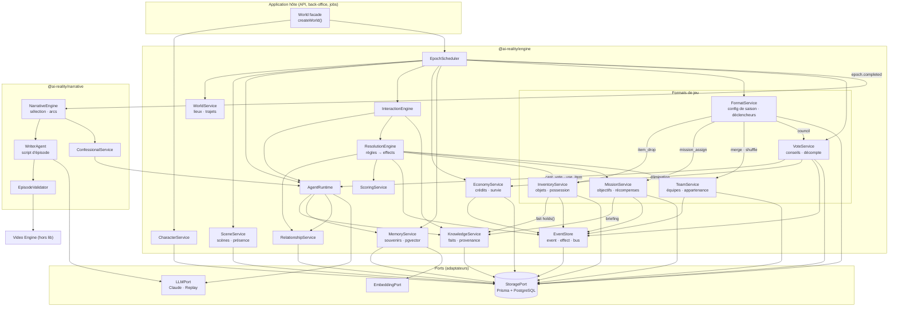
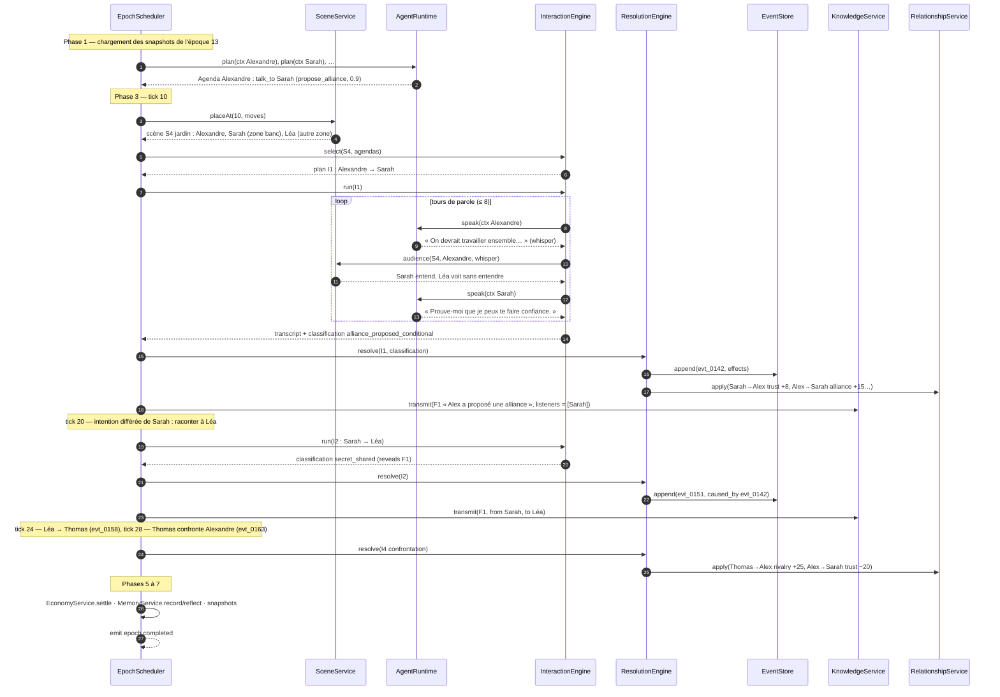
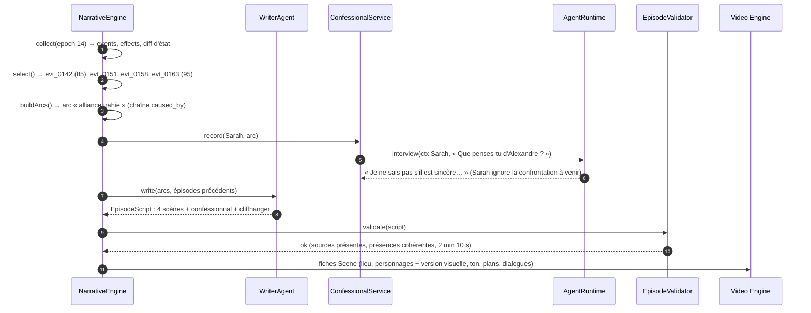

# AI Reality World — Services, interfaces et scénario

Document de conception · V0.1 · 2026-10-03

> Vue d'ensemble des services de la lib, de leurs contrats TypeScript, et d'un scénario de bout en bout.
> Détails : [`engine-architecture.md`](./engine-architecture.md) · [`database-model.md`](./database-model.md) · [`database-prisma.md`](./database-prisma.md)

---

## 1. Schéma des services



Règles de dépendance :
- Seul l'`EpochScheduler` orchestre. Les autres services ne s'appellent pas en cascade.
- Toute modification d'état passe par un `event` et des `effect` écrits dans l'`EventStore`. Seuls `ResolutionEngine`, `EconomyService`,
  `InventoryService`, `MissionService`, `TeamService` et `VoteService` en produisent.
- Les services de format ne sont actifs que si `season.format` les active (voir [`game-formats.md`](./game-formats.md)).
- Le paquet `narrative` ne lit la simulation qu'en **lecture seule** et n'écrit que dans les tables `episode_*`.

---

## 2. Liste des services

| Service | Responsabilité | Lit | Écrit | LLM |
|---|---|---|---|---|
| **CharacterService** | Créer, valider et compiler un personnage en profil d'agent | `character*` | `character*` | Non (compilation par template) |
| **WorldService** | Lieux, zones, graphe de trajets, règles de saison | `location*`, `season` | — | Non |
| **EpochScheduler** | Orchestrer les 7 phases et la boucle de ticks, reprise sur erreur | tout | `epoch` | Non |
| **SceneService** | Former et fermer les scènes, segments de présence, portée d'écoute | `presence`, `scene` | `presence`, `scene` | Non |
| **AgentRuntime** | Planifier, choisir une destination, parler, réfléchir | contexte filtré | — | **Oui** |
| **InteractionEngine** | Choisir qui parle à qui, dérouler les tours, appeler l'évaluateur | scène, relations | `interaction`, `utterance` | **Oui** (évaluateur) |
| **ResolutionEngine** | Classification → règles versionnées → effects | relations, traits | `event`, `effect` | Non |
| **RelationshipService** | Projeter les effects sur `relationship`, niveau de connaissance, snapshots | `relationship` | `relationship*` | Non |
| **ScoringService** | Scores pondérés `S = Σ wᵢ·eᵢ`, recalcul | `effect` | `score_entry` | Non |
| **EconomyService** | Ledger, coûts journaliers, machine d'état de survie | `credit_ledger` | `credit_ledger`, `event` | Non |
| **KnowledgeService** | Faits, transmission, provenance, filtre de visibilité | `fact`, `knowledge` | `fact`, `knowledge` | Non |
| **MemoryService** | Souvenirs, saillance, recherche vectorielle, réflexion de fin de journée | `memory` | `memory` | Oui (réflexion) |
| **EventStore** | Journal append-only, bus d'événements, rejeu | `event`, `effect` | `event`, `effect` | Non |
| **FormatService** | Charger le format de saison, planifier et déclencher les `scheduled_event` | `season`, `scheduled_event` | `scheduled_event.fired_event_id`, `event` | Non |
| **InventoryService** | Objets : placement, fouille, transferts, usage, faux objets ; fait `holds()` | `item*` | `item`, `event`, `effect`, `fact` | Non |
| **MissionService** | Attribuer, évaluer les objectifs (DSL) après chaque event, récompenser | `mission*`, `SimState` | `mission_assignment`, `event`, `effect` | Non |
| **TeamService** | Équipes, appartenance dans le temps, réunification, camps | `team*` | `team_membership`, `event` | Non |
| **VoteService** | Ouvrir un conseil, recueillir votes et objets joués, décompter, éliminer | `vote*`, `item` | `vote_session`, `vote`, `event`, `effect` | Non (choix via `DecisionPolicy`) |
| **NarrativeEngine** | Sélectionner les moments, construire les arcs | lecture seule | `narrative_arc` | Non |
| **WriterAgent** | Rédiger le script de l'épisode à partir des arcs | arcs, transcripts | `episode*` | **Oui** |
| **ConfessionalService** | Faire parler un personnage en interview, avec ses seules connaissances | via `AgentRuntime` | `episode_line` | **Oui** |
| **EpisodeValidator** | Vérifier les sources, les présences, la non-contradiction, la durée | `episode*`, `presence`, `event` | statut de l'épisode | Non |

---

## 3. Interfaces

### 3.1 Façade publique

```ts
interface World {
  characters: CharacterService;
  epochs: { run(opts: { number: number }): EpochRun; resume(epochId: Id): EpochRun };
  relationships: Pick<RelationshipService, 'between' | 'graph'>;
  knowledge: Pick<KnowledgeService, 'of'>;
  events: Pick<EventStore, 'list'>;
}

interface EpochRun extends TypedEmitter<EngineEvents> {
  done: Promise<EpochResult>;
  abort(): Promise<void>;
}

type EngineEvents = {
  'phase.started':    { epoch: number; phase: Phase };
  'scene.opened':     { scene: Scene };
  'utterance':        { utterance: Utterance };
  'effect.applied':   { effect: Effect };
  'character.status': { characterId: Id; from: Status; to: Status };
  'epoch.completed':  { epochId: Id };
};
```

### 3.2 Services du moteur

```ts
interface CharacterService {
  create(spec: CharacterSpec): Promise<Character>;
  compile(characterId: Id): Promise<AgentProfile>;            // persona + poids de décision
  setDirective(characterId: Id, d: { mode: Autonomy; text: string }): Promise<void>;
  state(characterId: Id, at?: { epoch: number }): Promise<CharacterState>;
}

interface WorldService {
  locations(): Promise<Location[]>;
  route(from: Id, to: Id): Promise<{ travelTicks: number }>;
  scheduledSlots(epoch: number): Promise<SeasonSlot[]>;       // repas, défis, annonces
}

interface SceneService {
  placeAt(tick: number, moves: Move[]): Promise<Presence[]>;   // trajets + rattachement aux scènes
  openScenes(tick: number): Promise<SceneWithPresence[]>;
  audience(sceneId: Id, speakerId: Id, volume: Volume): Promise<Listener[]>; // qui entend, qui voit
  close(sceneId: Id, tick: number): Promise<void>;
}

interface AgentRuntime {
  plan(ctx: AgentContext): Promise<Agenda>;
  chooseDestination(ctx: AgentContext, options: Location[]): Promise<Id>;   // scoré, sans LLM
  speak(ctx: ConversationContext): Promise<SpeechAct>;
  reflect(ctx: AgentContext, day: LivedEvent[]): Promise<Reflection>;
  interview(ctx: AgentContext, question: string): Promise<string>;           // confessionnal
}

interface InteractionEngine {
  select(scene: SceneWithPresence, agendas: Map<Id, Agenda>): Promise<InteractionPlan[]>;
  run(plan: InteractionPlan): Promise<{ interaction: Interaction; transcript: Utterance[]; classification: Classification }>;
}

interface ResolutionEngine {
  resolve(input: { interaction: Interaction; classification: Classification }): Promise<{ event: Event; effects: Effect[] }>;
  resolveCollective(slot: SeasonSlot, participants: Id[]): Promise<{ event: Event; effects: Effect[] }>;
}

interface RelationshipService {
  apply(effects: Effect[]): Promise<void>;                     // colonnes + extra_axes, clamp
  between(a: Id, b: Id): Promise<{ aToB: Relationship; bToA: Relationship }>;
  graph(opts?: { minAxis?: Partial<Record<Axis, number>> }): Promise<RelationshipEdge[]>;
  snapshot(epochId: Id): Promise<void>;
}

interface KnowledgeService {
  transmit(input: { factIds: Id[]; from: Id; listeners: Listener[]; viaEventId: Id }): Promise<Knowledge[]>;
  createFact(f: FactInput): Promise<Fact>;                     // vrai ou rumeur
  of(characterId: Id, filter?: { about?: Id; minConfidence?: number }): Promise<KnownFact[]>;
  provenance(characterId: Id, factId: Id): Promise<KnowledgeChain>;
}

interface MemoryService {
  record(characterId: Id, events: LivedEvent[]): Promise<Memory[]>;
  recall(characterId: Id, query: { about?: Id[]; text?: string; k: number }): Promise<Memory[]>; // pgvector
  decay(epochId: Id): Promise<void>;
}

interface EconomyService {
  charge(characterId: Id, entry: LedgerEntryInput): Promise<void>;
  settle(epochId: Id): Promise<SurvivalTransition[]>;          // fin d'époque
}

interface ScoringService {
  record(effects: Effect[]): Promise<void>;
  recompute(epochId: Id, rulesVersion?: number): Promise<void>;
}

interface EventStore {
  append(event: EventInput, effects: EffectInput[]): Promise<{ event: Event; effects: Effect[] }>;
  list(q: { epoch?: number; characterId?: Id; minImportance?: number }): Promise<Event[]>;
  replay(fromEpoch: number, apply: (e: Event, fx: Effect[]) => Promise<void>): Promise<void>;
}
```

### 3.3 Formats de jeu

```ts
interface FormatService {
  load(seasonId: Id): Promise<SeasonFormat>;                   // valide la config (§7 de game-formats.md)
  due(epoch: number, tick: number, state: SimState): Promise<ScheduledEvent[]>; // dates fixes + déclencheurs
  fire(e: ScheduledEvent): Promise<Event>;
}

interface InventoryService {
  place(itemDefId: Id, at: { locationId: Id; hidden: boolean; difficulty?: number }): Promise<Item>;
  transfer(input: { itemId: Id; from?: Id; to: Id; kind: 'found' | 'given' | 'traded' | 'stolen'; viaEventId: Id }): Promise<Effect[]>;
  use(itemId: Id, holderId: Id, context: ItemUseContext): Promise<ItemUseResult>;
  holdings(characterId: Id): Promise<Item[]>;                  // vérité ; un agent passe par KnowledgeService
}

interface MissionService {
  assign(missionDefId: Id, to: { characterId: Id } | { teamId: Id }): Promise<MissionAssignment>;
  evaluate(state: SimState, afterEvent: Event): Promise<MissionResolution[]>; // pur sur le SimState
  active(characterId: Id): Promise<MissionAssignment[]>;
}

interface TeamService {
  create(input: { slug: string; name: string; campLocationId?: Id }): Promise<Team>;
  move(characterId: Id, toTeamId: Id | null, epoch: number): Promise<void>;
  merge(teamIds: Id[], into: { slug: string; name: string }, epoch: number): Promise<Team>;
  members(teamId: Id, epoch: number): Promise<Id[]>;
}

interface VoteService {
  open(input: { epochId: Id; tick: number; sceneId: Id; kind: VoteKind; electorate: Electorate; rules: VoteRules }): Promise<VoteSession>;
  collect(sessionId: Id): Promise<{ votes: Vote[]; itemsPlayed: ItemUseResult[] }>; // DecisionPolicy de chaque électeur
  tally(sessionId: Id): Promise<VoteResult>;                   // règles du format, égalité, révote
  injectPublic(sessionId: Id, result: PublicVoteInput): Promise<VoteResult>; // format villa, entre deux époques
}
```

### 3.4 Narration

```ts
interface NarrativeEngine {
  collect(epochId: Id): Promise<EpochDigest>;                  // events, effects, diff d'état, arcs ouverts
  select(digest: EpochDigest, opts: { targetSeconds: number; minScreenTimePerPlayer: number }): Promise<Moment[]>;
  buildArcs(moments: Moment[]): Promise<NarrativeArc[]>;       // regroupement par caused_by_event_id
  produce(epochId: Id): Promise<Episode>;                      // pipeline complet
}

interface WriterAgent {
  write(input: { arcs: NarrativeArc[]; previously: EpisodeSummary[] }): Promise<EpisodeScript>;
}

interface ConfessionalService {
  record(characterId: Id, about: NarrativeArc): Promise<EpisodeLine>;   // AgentRuntime.interview
}

interface EpisodeValidator {
  validate(script: EpisodeScript): Promise<{ ok: boolean; issues: ValidationIssue[] }>;
}
```

### 3.5 Décision (points d'injection)

`AgentRuntime` délègue le choix d'action à une `DecisionPolicy`, et `InteractionEngine` délègue l'issue à un `OutcomeModel`.
Ces deux interfaces ont une implémentation LLM en V1, puis utilité et Monte Carlo : voir [`action-catalog.md`](./action-catalog.md) §5.

### 3.6 Ports

```ts
interface StoragePort { tx<T>(fn: (s: StorageTx) => Promise<T>): Promise<T> }   // impl. : prismaStorage(prisma)
interface LLMPort { complete<T>(req: LLMRequest): Promise<LLMResult<T>> }       // impl. : anthropicLLM, ReplayLLM
interface EmbeddingPort { embed(texts: string[]): Promise<number[][]> }
```

---

## 4. Scénario : époque 14, « l'alliance trahie »

**Situation initiale** : Alexandre (ambitieux, manipulateur) veut s'allier à Sarah contre Thomas.
Sarah a déjà une alliance secrète avec Léa. Confiance Sarah → Alexandre : 30.

### 4.1 Déroulé de la simulation



### 4.2 Production de l'épisode



### 4.3 Résultat

| Étape | Trace en base |
|---|---|
| Rencontre au jardin | `scene` S4 · `presence` ×3 · `interaction` I1 · `utterance` ×4 |
| Conséquences | `event` evt_0142 · `effect` ×6 · `relationship` mis à jour |
| Propagation | `knowledge` Sarah → Léa → Thomas, chaînées par `parent_knowledge_id` |
| Retournement | evt_0163 : l'alliance devient une rivalité (`labels` : `rival`) |
| Épisode 14 | `episode` · `narrative_arc` · `episode_scene` ×4 · `episode_line` (dialogues, confessionnal, voix off) |
